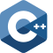

Hello there! I’m Juan Luis, a junior frontend web developer looking for my fist opportunity to collaborate in a company where I can contribute and keep growing as a professional.
As an aspiring developer, I've been learning the front-end basic technologies in order to improve my tech skills and be hired by a company in the development industry. So far, I've taken several courses and tutorials for this purpose, for instance:

- [FreeCodeCamp](https://www.freecodecamp.org/mendibox)
- [W3Schools](https://www.w3profile.com/mendibox)
- [Frontend Mentor](https://www.frontendmentor.io/profile/mendibox)
- [Platzi](https://platzi.com/p/mendibox/)

## Continuous learning

As an aspirin software developer, I do understand the importance to keep learning different tools, programming languages, frameworks, etc. In this section you can see what I've learned so far.

### Programming languages

### Markup languages

### Styling
